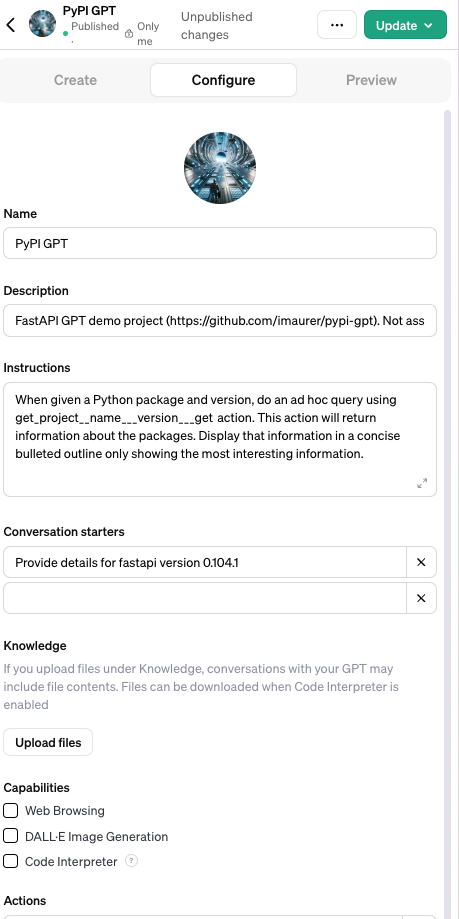
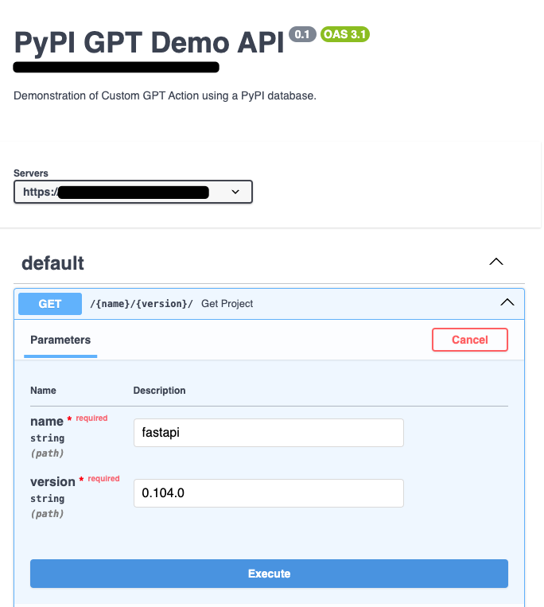
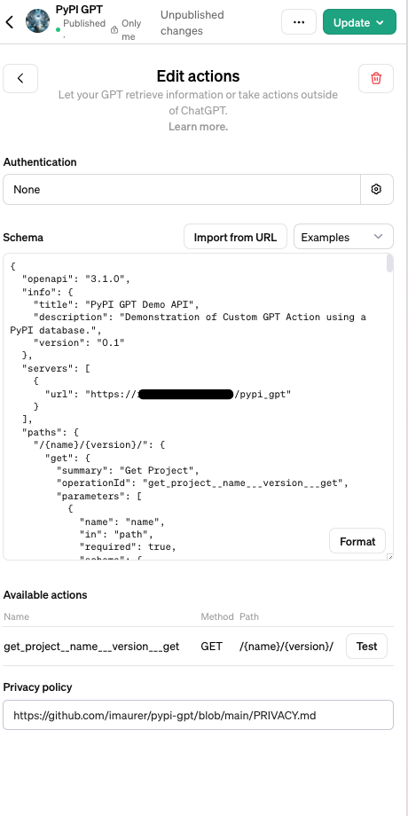
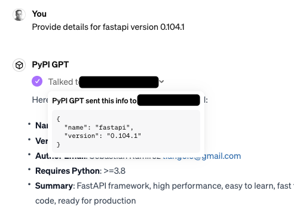
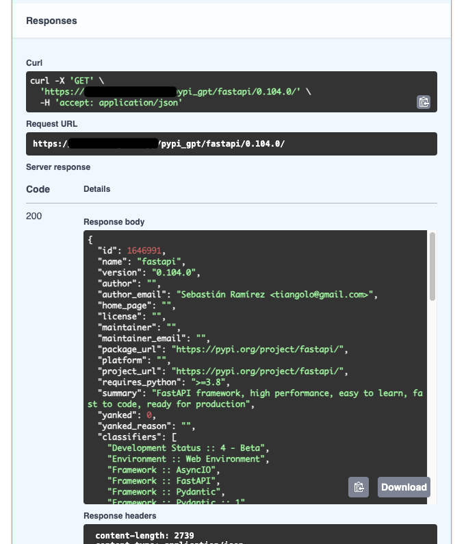
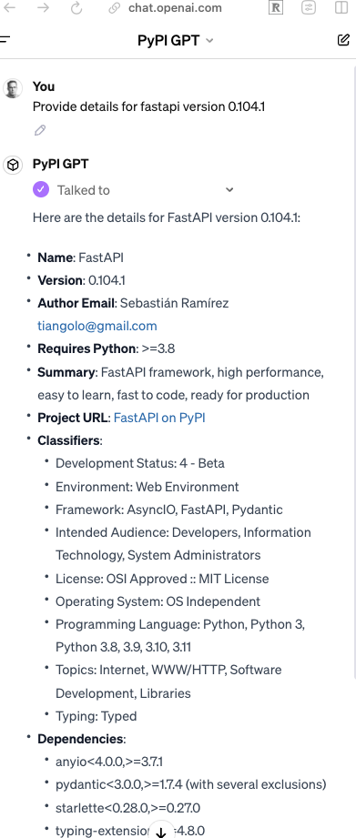

# PyPI GPT

This is an open-source demonstration (MIT License) of building actions for Custom GPTs. It is
built with FastAPI, SQLModel and Pydantic.

This project is NOT associated with [Python Software Foundation](https://www.python.org/psf-landing/)
or the [Python Package Index (PyPI)](https://pypi.org/).

The data used was downloaded from the [pypi-data/pypi-json-data](https://github.com/pypi-data/pypi-json-data)
repository.

If you want to efficiently parse a requirements file, you don't need this project. Instead, use
something like [requirements-parser project](https://pypi.org/project/requirements-parser/).

## Getting Started

### Setup Environment

This project was built using Python 3.11 and the Makefile scripts assume a virtual environment
can be found under the relative path `./env` from the root of the project.

I have a Makefile for the major steps, below is a description of those steps.

#### Create Environment and Install Dependencies

```bash
    $ python3.11 -m venv env
    $ make install
```

#### Download, Unzip and Index Database

Downloads data from the  [pypi-data/pypi-json-data](https://github.com/pypi-data/pypi-json-data) project.
Unzips and indexes the file.

```bash
    $ make download_db
```

#### Test Code

```bash
    $ make test
    $ make cov
```

#### Run API

You need to run this on a server or service that supports HTTPS. I use ngrok and nginx locally.

```bash
  $ export PYPI_GPT_SERVER_HOSTNAME=(YOUR HOST NAME HERE!)
  $ make api
```

### Screenshots


#### Configure Custom GPT




#### OpenAPI Spec




#### Import Actions




#### Chat Calls Server




#### OpenAPI Response




#### Chat Formats Result


